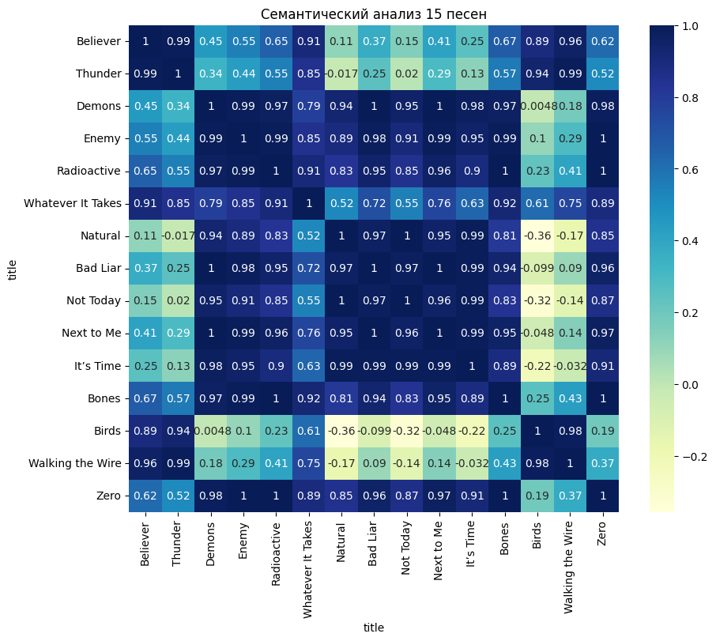
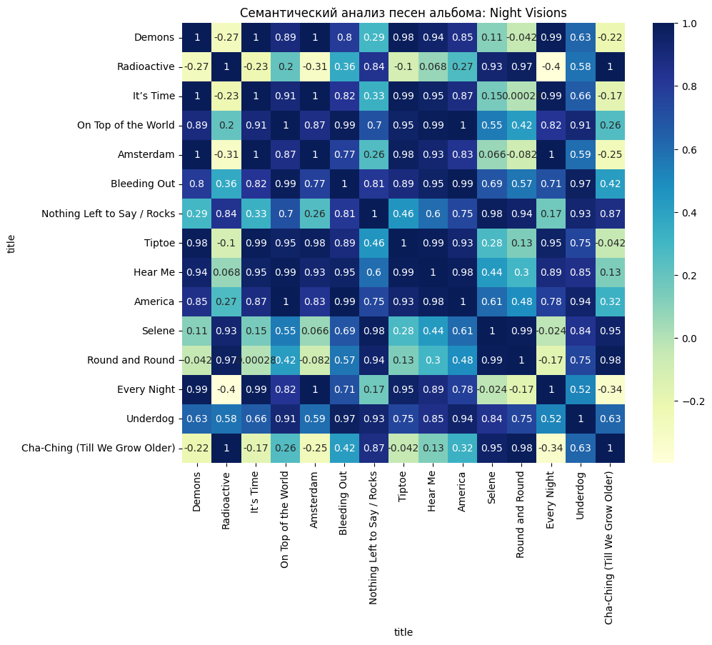

# Практическая работа №2

## Цели
Необходимо, с использованием результатов, полученных при выполнении Практической работы №1, спроектировать и реализовать прототип семантического анализатора естественного языка (Latent Semantic Analysis, LSA). Используйте векторы TF-IDF, векторы тем, стемминг и т.п.

Программную реализацию необходимо разместить в любом открытом Git-репозитории. В файле README следует привести инструкцию по сборке, развертыванию и использованию анализатора с примерами его работы, в том числе с пользовательскими данными. Альтернативно — создать архив проекта и разместить его в облачном хранилище. Допустимые форматы: zip, tar.gz, 7z.

## Задачи
- Использовать набор данных из Практической работы №1;
- Провести нормализацию данных;
- Реализовать семантический анализатор естественного языка;
- В файле README привести инструкцию по сборке, развертыванию и использованию анализатора с примерами его работы, в том числе с пользовательскими данными;
- Разместить программную реализацию в Git-репозитории.

## Решение
Файл ```main.ipynb``` содержит программную реализацию, выполняющую семантический анализ песен группы *Imagine Dragons*.

Для выявления схожести песен было проведено два эксперимента по анализу данных:
1. Анализ 15 самых популярных песен;
2. Анализ песен из одного альбома.

Предполагалось, что первая проверка не покажет сильной семантической связи, так как песни написаны на разные темы и в разные периоды времени. Именно поэтому был проведён анализ песен, принадлежащих к одному альбому, в надежде, что они будут объединены одной общей темой.

## Результат
На изображениях ниже представлены результаты семантического анализа песен.



Из представленного изображения можно сделать вывод, что предположения, выдвинутые ранее, опроверглись, так как в центре тепловой карты можно заметить сильную семантическую связь.

Вероятнее всего причиной этому служит тот факт, что песни расположены по популярности. Это указывает на то, что слушатели группы предпочитают композиции, объединённые одной тематикой.

Что касается *Believer* и *Thunder*, то эти песни являются хитами с более масштабной аудиторией, и, вероятно, поэтому выбиваются из общей картины. Однако при этом между собой данные композиции демонстрируют высокую семантическую связь.



Как и ожидалось, анализ песен с одного альбома также показал высокий уровень семантической связи. Даже с учётом того, что на релизе присутствуют композиции, выбивающиеся из общей картины, в большинстве своём можно сказать, что теория о высокой семантической связи внутри альбома подтвердилась.

## Формат ввода
Для использвоания семантического анализатора необходимо вписать свой текст в ```data/text.txt```. 

**Анализатор считает предложение завершенным, когда видит точку**.

*Пример ввода:*
```
I love cooking pasta with different sauces.
Yesterday we had dinner at an Italian restaurant.
Fresh vegetables are good for your health.
My favorite dessert is chocolate cake.
For breakfast, I usually eat oatmeal with fruits.
I go jogging in the park every morning.
The football team won yesterday's match.
Yoga helps me relax and relieve stress.
He trains at the gym five times a week.
Swimming is a great way to stay in shape.
I bought a new smartphone with a good camera.
Artificial intelligence is changing many professions.
Computer games help improve reaction time.
I use cloud storage for my files.
In the future, robots will perform routine tasks.
```

## Инструкция по сборке:
- Клонировать данный репозиторий командой: ```git clone https://github.com/so1ed/MoNLP_lab.git```
- Перейти в нужную директорию командой: ```cd MoNLP_lab\lab2```
- В python окружении запустить: ```pip install -r requirements.txt```
- Указать в файле ```text.txt``` необходимый текст.
- Выполнить команду: ```jupyter notebook lab2.ipynb```