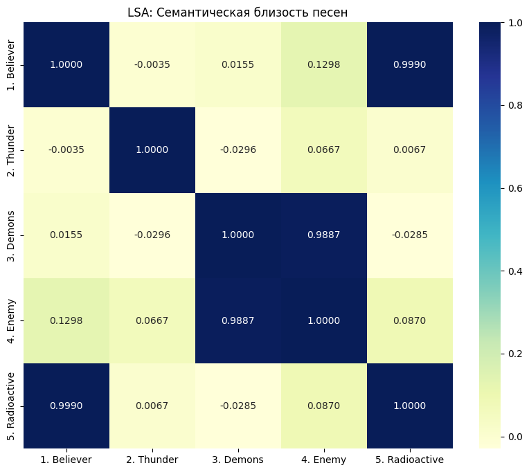
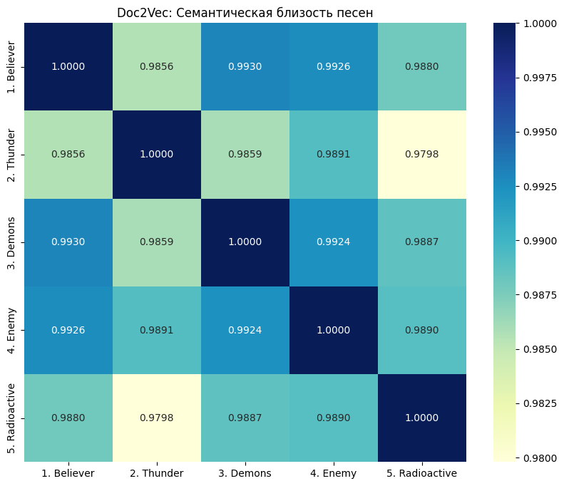

# Практическая работа №3

## Цели
Необходимо на основе результатов, полученных при выполнении Практической работы №2, расширить полученный семантический анализатор естественного языка для обработки набора документов (например, на схожесть). Используйте Doc2Vec и/или Word2Vec.

Программную реализацию необходимо разместить в любом открытом Git-репозитории. В файле README следует привести инструкцию по сборке, развертыванию и использованию анализатора с примерами его работы, в том числе с пользовательскими данными. Альтернативно — создать архив проекта и разместить его в облачном хранилище. Допустимые форматы: zip, tar.gz, 7z.

## Задачи
- Использовать данные из Практической работы №2;
- Провести нормализацию данных;
- Реализовать семантический анализатор естественного языка;
- В файле README привести инструкцию по сборке, развертыванию и использованию анализатора с примерами его работы, в том числе с пользовательскими данными;
- Разместить программную реализацию в Git-репозитории.

## Решение
Файл `lab3.ipynb` содержит программную реализацию, выполняющую семантический анализ текстовых документов с использованием трех методов: LSA, Doc2Vec и Word2Vec.

Для выявления схожести документов был проведен эксперимент по анализу текстовых файлов, содержащих тексты песен группы *Imagine Dragons*.

## Результат
Программа выполняет комплексный анализ текстовых данных:

1. Анализ тональности (положительная, отрицательная, нейтральная)
```
Тональность песен:
Песня '1. Believer': нейтральную тональность
Песня '2. Thunder': нейтральную тональность
Песня '3. Demons': нейтральную тональность
Песня '4. Enemy': нейтральную тональность
Песня '5. Radioactive': нейтральную тональность
```

2. LSA анализ. Выявляет основные темы в документах 
```
Темы LSA:
Тема 1: oh, believer, npain, ni, ooh
Тема 2: hide, look, demon, enemy, thunder
Тема 3: thunder, nthunder, th, nlightning, thun
```

3. Word2Vec анализ. Показывает семантически похожие слова
```
Семантически похожие слова:
thunder: clappin, dye, nat
nthunder: send, breaking, new
```

4. LSA визуализация. Визуализирует схожесть документов через тепловую карту.

Как можно заметить песни LSA выявило 2 пары довольно сильной симантической близости, а именно:
    - Demons и Enemy
    - Beliver и Radioactive

    Что касается остальных композиций, то связть крайне слабая.

5. Doc2Vec анализ. Визуализирует схожесть документов через тепловую карту.

Doc2Vec анализ показал совершенно обратный результат, ведь из визуализации становиться видно, что связь сильная между всеми песенями. Отдельно можно выделить:
    - Demons и Enemy (как и в LSA)
    - Beliver и Demons (наивысшая связь)
    - Beliver и Enemy

## Формат ввода
Для использвоания семантического анализатора необходимо вставить свои файлы формата .txt в ```data/text```. 

## Инструкция по сборке:
- Клонировать данный репозиторий командой: ```git clone https://github.com/so1ed/MoNLP_lab.git```
- Перейти в нужную директорию командой: ```cd MoNLP_lab\lab3```
- В python окружении запустить: ```pip install -r requirements.txt```
- Поместить свои файлы в ```data/text``` *(опционально)*
- Выполнить команду: ```jupyter notebook lab3.ipynb```