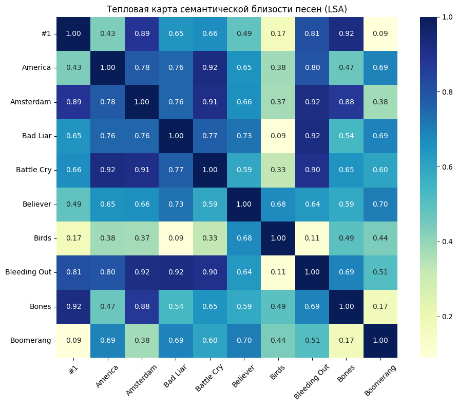

# Практическая работа №4

## Цели
Необходимо на основе результатов, полученных при выполнении Практической работы №3, расширить полученный семантический анализатор естественного языка для обработки корпуса документов. Используйте нейросети CNN и/или RNN.

Программную реализацию необходимо разместить в любом открытом Git-репозитории. В файле README следует привести инструкцию по сборке, развертыванию и использованию анализатора с примерами его работы, в том числе с пользовательскими данными. Альтернативно — создать архив проекта и разместить его в облачном хранилище. Допустимые форматы: zip, tar.gz, 7z.

## Задачи
- Использовать данные из Практической работы №3;
- Провести нормализацию данных;
- Реализовать семантический анализатор естественного языка;
- В файле README привести инструкцию по сборке, развертыванию и использованию анализатора с примерами его работы, в том числе с пользовательскими данными;
- Разместить программную реализацию в Git-репозитории.

## Решение
Файл `lab4.ipynb` содержит программную реализацию, выполняющую семантический анализ текстовых документов с использованием трех методов: **LSA, Doc2Vec и Word2Vec**, реалезованные в *Практической работе №3*, а также новый метод анализа **CNN**.

Для выявления схожести документов был проведен эксперимент по анализу текстовых файлов, содержащих тексты песен группы *Imagine Dragons*.

## Результат
Программа выполняет комплексный анализ текстовых данных:

1. Анализ тональности (положительная, отрицательная, нейтральная)
```
Тональность песен:
Песня 1 (#1) имеет положительную тональность
Песня 2 (America) имеет положительную тональность
Песня 3 (Amsterdam) имеет положительную тональность
Песня 4 (Bad Liar) имеет отрицательную тональность
Песня 5 (Battle Cry) имеет отрицательную тональность
...
```

2. LSA анализ. Выявляет основные темы в документах 
```
Список самых значимых слов в темах (LSA):
Тема 1: oh, hey, ooh, da, know
Тема 2: da, la, thunder, follow, young
Тема 3: la, hey, gun, okay, love
Тема 4: hey, ooh, da, giving, gun
Тема 5: oh, ready, la, whoa, da
Тема 6: ooh, la, day, fly, night
Тема 7: ah, ooh, yeah, beach, mountain
Тема 8: enemy, everybody, look, want, pray
```

3. Word2Vec анализ. Показывает семантически похожие слова
```
Семантически похожие слова (Word2Vec):
hey: paying, west, due, c, bu
ooh: threw, gate, direction, ragin, opulence
```

4. LSA визуализация. Визуализирует схожесть документов через тепловую карту. 

Как можно заметить при значении в 8 тем, большинство песен имеет высокую семантическую близость. Из этого можно сделать вывод, что песни написанны на одну тему.

5. Doc2Vec анализ. Визуализирует схожесть документов через тепловую карту.

Doc2Vec анализ показал слабую связь, за исключением пары песен.

6. CNN анализ. При обучении на **100 песнях и test_size=0.4** Сверточная нейронная сеть показала точность классификации тональности текстов песен в 77.5%
```
Epoch 1/10
8/8 ━━━━━━━━━━━━━━━━━━━━ 3s 67ms/step - accuracy: 0.3833 - loss: 1.2233 - val_accuracy: 0.7000 - val_loss: 0.6383
Epoch 2/10
8/8 ━━━━━━━━━━━━━━━━━━━━ 0s 20ms/step - accuracy: 0.6000 - loss: 0.9318 - val_accuracy: 0.6750 - val_loss: 0.5856
Epoch 3/10
8/8 ━━━━━━━━━━━━━━━━━━━━ 0s 19ms/step - accuracy: 0.7333 - loss: 0.6257 - val_accuracy: 0.5000 - val_loss: 0.7124
Epoch 4/10
8/8 ━━━━━━━━━━━━━━━━━━━━ 0s 25ms/step - accuracy: 0.7500 - loss: 0.6855 - val_accuracy: 0.6750 - val_loss: 0.5666
Epoch 5/10
8/8 ━━━━━━━━━━━━━━━━━━━━ 0s 26ms/step - accuracy: 0.8667 - loss: 0.4488 - val_accuracy: 0.7500 - val_loss: 0.6081
Epoch 6/10
8/8 ━━━━━━━━━━━━━━━━━━━━ 0s 22ms/step - accuracy: 0.8333 - loss: 0.4439 - val_accuracy: 0.7750 - val_loss: 0.5876
Epoch 7/10
8/8 ━━━━━━━━━━━━━━━━━━━━ 0s 22ms/step - accuracy: 0.8833 - loss: 0.3507 - val_accuracy: 0.6500 - val_loss: 0.5736
Epoch 8/10
8/8 ━━━━━━━━━━━━━━━━━━━━ 0s 21ms/step - accuracy: 0.9833 - loss: 0.2687 - val_accuracy: 0.8250 - val_loss: 0.5827
Epoch 9/10
8/8 ━━━━━━━━━━━━━━━━━━━━ 0s 24ms/step - accuracy: 0.9833 - loss: 0.2110 - val_accuracy: 0.6750 - val_loss: 0.6086
Epoch 10/10
8/8 ━━━━━━━━━━━━━━━━━━━━ 0s 24ms/step - accuracy: 0.9667 - loss: 0.1826 - val_accuracy: 0.7750 - val_loss: 0.5699

Точность определения тональности равна: 0.775
```

## Формат ввода
Для использвоания семантического анализатора необходимо вставить свои файлы формата **.txt** в ```data/text```. 

## Инструкция по сборке:
- Клонировать данный репозиторий командой: ```git clone https://github.com/so1ed/MoNLP_lab.git```
- Перейти в нужную директорию командой: ```cd MoNLP_lab\lab4```
- В python окружении запустить: ```pip install -r requirements.txt```
- Поместить свои файлы в ```data/text``` *(опционально)*
- Выполнить команду: ```jupyter notebook lab4.ipynb```