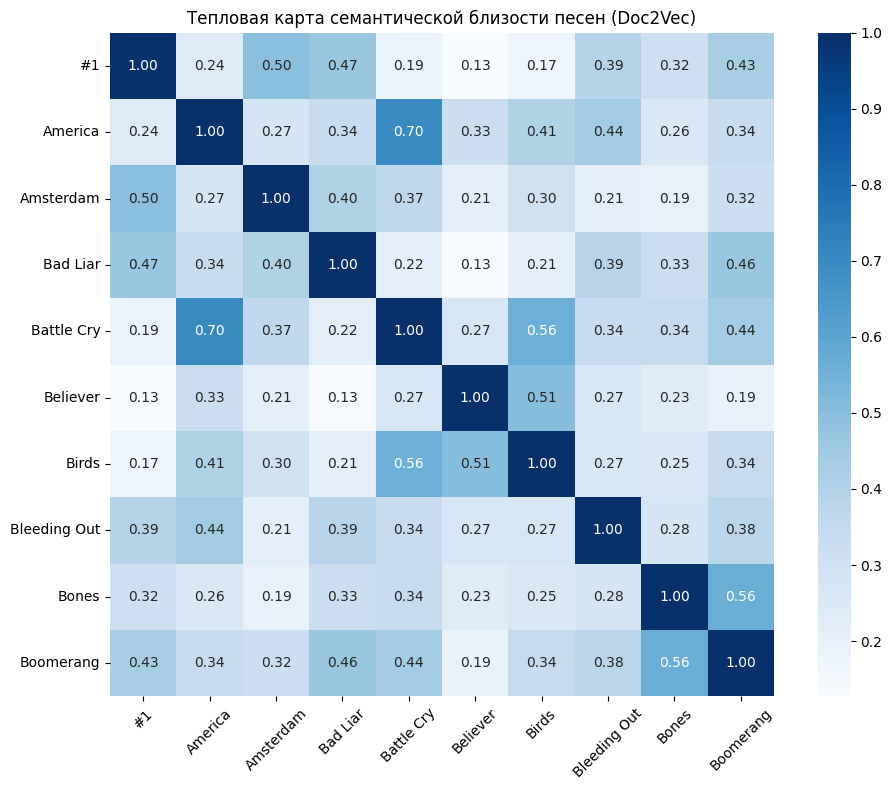

# Практическая работа №5

## Цели
Необходимо на основе результатов, полученных при выполнении Практической работы №4, расширить полученный семантический анализатор естественного языка средствами генерации осмысленного текста только на его основе. Используйте нейросети классов LSTM, а также методы sequence-to-secuence.  Внимание: допускается использовать генераторы только на основе шаблонов. Другие, в том числе гибридные подходы изучаются в следующем элементе практикума.

Программную реализацию необходимо разместить в любом открытом GIT-репозитории. В файле README необходимо привести инструкцию по сборке, развертыванию и использованию анализаторов с примерами работы генератора текста и четырех полученных семантических анализаторов (в том числе пользовательских данных), а также их сравнительное описание. Альтернативно - создать архив проекта (с документацией), разместить в облачном хранилище. Допустимые форматы: zip, tar.gz, 7z.

## Задачи
- Использовать данные из Практической работы №4;
- Провести нормализацию данных;
- Расширить полученный семантический анализатор естественного языка средствами генерации осмысленного текста только на его основе;
- В файле README привести инструкцию по сборке, развертыванию и использованию анализатора с примерами его работы, в том числе с пользовательскими данными;
- Разместить программную реализацию в Git-репозитории.

## Решение
Файл `lab5.ipynb` содержит программную реализацию, выполняющую семантический анализ текстовых документов с использованием трех методов: **LSA, Doc2Vec и Word2Vec**, реалезованные в *Практической работе №3*, а также новый метод анализа **CNN** (*Практическая работа №4*). В рамках *Практической работы №5* был реалезован генератор осмысленного текста только на основе семантического анализа при помощи **LSTM и sequence-to-secuence**.

В качестве датасета были взяты текстовые файлы, содержащие тексты песен группы *Imagine Dragons*.

## Результат
Программа выполняет комплексный анализ текстовых данных:

1. Анализ тональности (положительная, отрицательная, нейтральная)
```
Тональность песен:
Песня 1 (#1) имеет положительную тональность
Песня 2 (America) имеет положительную тональность
Песня 3 (Amsterdam) имеет положительную тональность
Песня 4 (Bad Liar) имеет отрицательную тональность
Песня 5 (Battle Cry) имеет отрицательную тональность
...
```

2. LSA анализ. Выявляет основные темы в документах 
```
Список самых значимых слов в темах (LSA):
Тема 1: oh, hey, ooh, da, know
Тема 2: da, la, thunder, follow, young
Тема 3: la, hey, gun, okay, love
Тема 4: hey, ooh, da, giving, gun
Тема 5: oh, ready, la, whoa, da
Тема 6: ooh, la, day, fly, night
Тема 7: ah, ooh, yeah, beach, mountain
Тема 8: enemy, everybody, look, want, pray
```

3. Word2Vec анализ. Показывает семантически похожие слова
```
Семантически похожие слова (Word2Vec):
hey: paying, west, due, c, bu
ooh: threw, gate, direction, ragin, opulence
```

4. LSA визуализация. Визуализирует схожесть документов через тепловую карту. 

Как можно заметить при значении в 8 тем, большинство песен имеет высокую семантическую близость. Из этого можно сделать вывод, что песни написанны на одну тему.

5. Doc2Vec анализ. Визуализирует схожесть документов через тепловую карту.

Doc2Vec анализ показал слабую связь, за исключением пары песен.

6. CNN анализ. При обучении на **100 песнях и test_size=0.4** Сверточная нейронная сеть показала точность классификации тональности текстов песен в 77.5%
```
Epoch 1/10
8/8 ━━━━━━━━━━━━━━━━━━━━ 3s 67ms/step - accuracy: 0.3833 - loss: 1.2233 - val_accuracy: 0.7000 - val_loss: 0.6383
Epoch 2/10
8/8 ━━━━━━━━━━━━━━━━━━━━ 0s 20ms/step - accuracy: 0.6000 - loss: 0.9318 - val_accuracy: 0.6750 - val_loss: 0.5856
Epoch 3/10
8/8 ━━━━━━━━━━━━━━━━━━━━ 0s 19ms/step - accuracy: 0.7333 - loss: 0.6257 - val_accuracy: 0.5000 - val_loss: 0.7124
Epoch 4/10
8/8 ━━━━━━━━━━━━━━━━━━━━ 0s 25ms/step - accuracy: 0.7500 - loss: 0.6855 - val_accuracy: 0.6750 - val_loss: 0.5666
Epoch 5/10
8/8 ━━━━━━━━━━━━━━━━━━━━ 0s 26ms/step - accuracy: 0.8667 - loss: 0.4488 - val_accuracy: 0.7500 - val_loss: 0.6081
Epoch 6/10
8/8 ━━━━━━━━━━━━━━━━━━━━ 0s 22ms/step - accuracy: 0.8333 - loss: 0.4439 - val_accuracy: 0.7750 - val_loss: 0.5876
Epoch 7/10
8/8 ━━━━━━━━━━━━━━━━━━━━ 0s 22ms/step - accuracy: 0.8833 - loss: 0.3507 - val_accuracy: 0.6500 - val_loss: 0.5736
Epoch 8/10
8/8 ━━━━━━━━━━━━━━━━━━━━ 0s 21ms/step - accuracy: 0.9833 - loss: 0.2687 - val_accuracy: 0.8250 - val_loss: 0.5827
Epoch 9/10
8/8 ━━━━━━━━━━━━━━━━━━━━ 0s 24ms/step - accuracy: 0.9833 - loss: 0.2110 - val_accuracy: 0.6750 - val_loss: 0.6086
Epoch 10/10
8/8 ━━━━━━━━━━━━━━━━━━━━ 0s 24ms/step - accuracy: 0.9667 - loss: 0.1826 - val_accuracy: 0.7750 - val_loss: 0.5699

Точность определения тональности равна: 0.775
```

Генерация осмысленного текста на основе семантического анализа:

1. LSTM генерация. Обучение проводилось со следующими настройками: **batch_size=128, epochs=10**. В целом хоть текст и не выгляит сильно связным, в контексте текста песни, этот результат впролне устравивает.
```
Начальная последовательность:
ve never seen this side of you
Oh-oh oh-

Diversity: 0.2
Сгенерировано:
oh oh
Oh, oh oh oh
Oh, the might ease the maght that to change everything the stangt the stang
Love my buttire my side
We are, I down take my sout
I came the that soun that sou' of my sone

'Cause I k...

Diversity: 0.8
Сгенерировано:
now)
'hase the mallin' for it's like arker dream
I wan'd hare my night
Let me the knew you know I'll me the Right what I could mu?
Trybe thase the gigh
It's sarding that I dod, thongin' my sous
It's d...
```

2. SEQ2SEQ генерация. Результаты у модели далеко не самые лучшие, чтобы добиться хоть какого-то результата обучения было выставленно 400 эпох. Но особого результата это не дало.
```
Пример 1:
Вход: gon na learn got let thing go watching candle burn
Сгенерировано:
wan live live live loo loo loo lool love llove

Пример 2:
Вход: feel close feel close like wanted feel close like wanted
Сгенерировано:
wan live live live loo loo loo lool love love
```

## Формат ввода
Для использвоания семантического анализатора необходимо вставить свои файлы формата **.txt** в ```data/text```. 

## Инструкция по сборке:
- Клонировать данный репозиторий командой: ```git clone https://github.com/so1ed/MoNLP_lab.git```
- Перейти в нужную директорию командой: ```cd MoNLP_lab\lab5```
- В python окружении запустить: ```pip install -r requirements.txt```
- Поместить свои файлы в ```data/text``` *(опционально)*
- Выполнить команду: ```jupyter notebook lab5.ipynb```